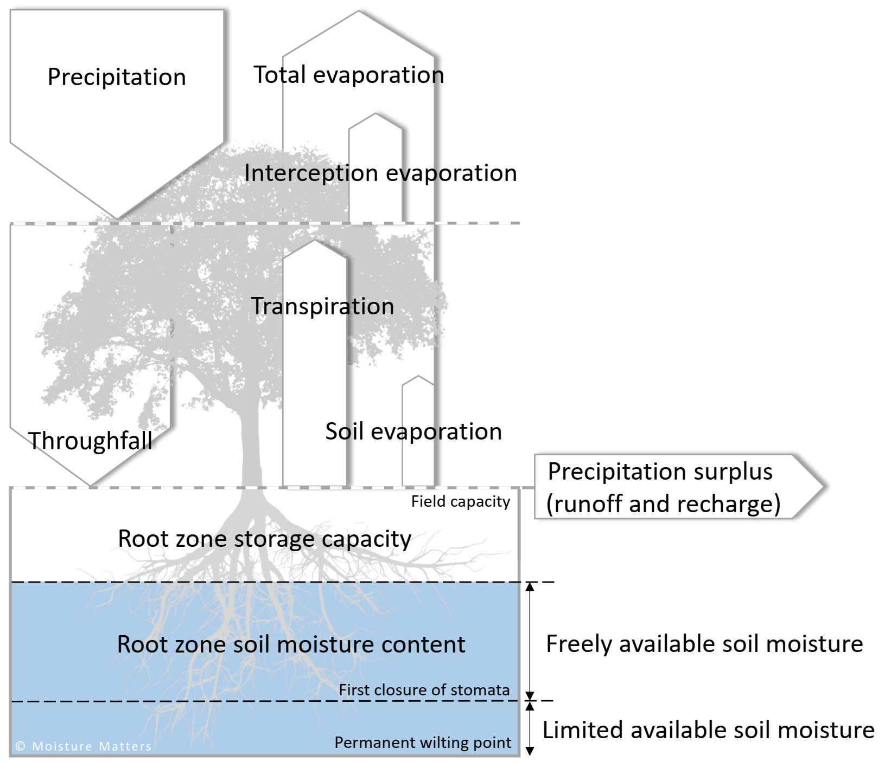

# FluxPark  
**A spatially explicit hydrological model for simulating evaporation fluxes & groundwater recharge**

### Overview  
FluxPark is an open‑source Python library that transforms daily meteorological data and land‑use maps into spatially distributed evaporation and recharge estimates. It's built for:

- **Speed & simplicity**: Few parameters and efficient computation make it ideal for rapid calibration and custom adaptation.  
- **Process separation**: By modelling interception, transpiration and soil evaporation separately, FluxPark reacts realistically to changing weather and soil moisture conditions.  
- **Modularity**: A core simulation engine can be extended with optional modules—perfect for groundwater modellers looking for a lightweight, transparent tool.

FluxPark is developed and maintained by **[Moisture Matters](https://www.moisture-matters.nl)** 🌍. While the core model is freely available on GitHub and PyPI, regional inputs (maps, parameter tables) are delivered as part of our support contract. Your subscription helps fund ongoing maintenance and future enhancements.

### Enterprise & SaaS  
For operational water management, FluxPark is integrated with satellite imagery, weather forecasts and field sensors in our digital‑twin platform **[StellaSpark Nexus](https://www.stellaspark.com/drought-monitoring)** 🌍—offered as a SaaS solution for real‑time monitoring and scenario analysis.



## Installation
Install FluxPark using pip

```bash
pip install fluxpark
```
### Dependencies
> [!IMPORTANT]
> In addition to installing FluxPark with `pip`, you **must** have the GDAL library installed on your system.  
The simplest approach is to run:
 
```bash
conda install -c conda-forge gdal
```

- GDAL >= 3.2
- Python >= 3.9

If you have difficulty getting GDAL and FluxPark set up, we provide a ready‑made conda environment file:
1. Download `fluxpark_env.yml` from the `docs/` folder.  
2. In your terminal, navigate to its directory and run:
```bash
conda env create -f fluxpark_env.yml
```
3. Activate it
```bash
conda activate fluxpark_env
```
4. Open your editor (e.g. VS Code or Spyder) and select this environment as your interpreter.
This will ensure all dependencies —including GDAL and Python— are installed correctly.

## Usage
FluxPark requires spatial raster maps for:

- **Land‑use IDs**  
- **Plant available soil moisture between field capacity** and **permanent wilting point**  
- **Plant available soil moisture between field capacity** and **stomatal closure point** 

It also needs three tables:

1. **`fluxpark_output_mapping.csv`**  
2. **`conv_luse_evap_ids.csv`**  
3. An Excel workbook containing daily evaporation parameters (soil coverage, interception capacity, and crop factors for transpiration, soil evaporation, and interception evaporation).

A unique feature of FluxPark is that all evaporation parameters can be *scaled* by soil cover, enabling higher‑resolution, spatially explicit simulations.

The core simulation is orchestrated by the **FluxParkRunner**, which handles setup and time‑stepping. Users configure the model via the **FluxParkConfig** class—inspect its docstring to explore all available options.

FluxPark uses a **ports and adapters** pattern to decouple data sources from the model core. The `RunnerPorts` dataclass defines all input and output connections; built‑in adapters are available under `flp.adapters`. You can also write your own adapters to supply meteorological data.

### Example 1 — KNMI NetCDF files (built‑in adapter)

```python
import fluxpark as flp

cfg = flp.config.FluxParkConfig(
    date_start="2021-01-01",
    date_end="2021-01-10",
    calc_epsg_code=28992,
    x_min=81000.0,
    x_max=152000.0,
    y_min=454000.0,
    y_max=580000.0,
    cellsize=100,
    evap_param_table="20250708_evap_parameters.xlsx",
    output_files=["prec_surplus_mm_d", "evap_total_act_mm_d"],
    indir="./input_data",
    outdir="./output_data")

runner_ports = flp.RunnerPorts(
    rain_provider=flp.adapters.make_knmi_netcdf_rain_provider(
        r"./input_data/knmi/prec"
    ),
    etref_provider=flp.adapters.make_knmi_netcdf_etref_provider(
        r"./input_data/knmi/etref"
    ),
)

runner = flp.FluxParkRunner(cfg, runner_ports=runner_ports)
runner.run()
```

### Example 2 — custom adapter

You can supply any data source by writing a provider function that accepts the runner object and returns a 2D NumPy array. The runner object exposes `runner.date` (current date) and `runner.grid_params` (grid dimensions and projection).

```python
import fluxpark as flp
import numpy as np

cfg = flp.config.FluxParkConfig(
    date_start="2021-01-01",
    date_end="2021-01-10",
    calc_epsg_code=28992,
    x_min=81000.0,
    x_max=152000.0,
    y_min=454000.0,
    y_max=580000.0,
    cellsize=100,
    evap_param_table="20250708_evap_parameters.xlsx",
    output_files=["prec_surplus_mm_d", "evap_total_act_mm_d"],
    indir="./input_data",
    outdir="./output_data")

def my_rain_provider(runner):
    # Return a constant rain grid of 3.0 mm/d
    shape = (runner.grid_params["nrows"], runner.grid_params["ncols"])
    return np.full(shape, 3.0, dtype="float32")

def my_etref_provider(runner):
    # Return a constant ETref grid of 1.0 mm/d
    shape = (runner.grid_params["nrows"], runner.grid_params["ncols"])
    return np.full(shape, 1.0, dtype="float32")

runner_ports = flp.RunnerPorts(
    rain_provider=my_rain_provider,
    etref_provider=my_etref_provider,
)

runner = flp.FluxParkRunner(cfg, runner_ports=runner_ports)
runner.run()
```

## License
FluxPark is released under the **FluxPark Custom License v1.0**.  
See [LICENSE.txt](LICENSE.txt) for the full terms and conditions.
